# 基于Web足球青训俱乐部管理后台系统

#### 介绍

基于Web的足球青训俱乐部管理后台系统是一款专为足球青训俱乐部设计的管理平台，旨在提高俱乐部管理的效率和服务的便捷性。系统分为管理端、教练端和学生端，每个角色拥有特定的功能模块，满足不同用户的需求和职责。

#### 技术栈

后端技术栈：Springboot+Mysql+Maven

前端技术栈：Vue+Html+Css+Javascript+ElementUI

开发工具：Idea+Vscode+Navicate

#### 系统功能介绍

管理端功能模块

个人中心：查看和编辑个人信息，包括修改密码和更新联系方式。

学员管理：管理俱乐部学员信息，包括学员的注册、审核、修改和删除。

教练管理：管理教练信息，包括教练的注册、审核、修改和删除。

公告信息管理：发布和管理俱乐部的公告信息，确保所有成员及时获取重要通知。

商品信息管理：管理俱乐部商品的信息，包括新增、修改和删除商品。

课程安排管理：管理俱乐部的课程安排，确保课程的合理分配和及时更新。

课程签到管理：管理学员的课程签到信息，确保签到数据的准确记录。

统计中心管理：提供各种数据统计功能，帮助管理者进行数据分析和决策。

系统管理：管理系统的设置和维护，确保系统的正常运行。

订单管理：查看和管理俱乐部的订单信息，确保订单的及时处理和发货。

学生端功能模块

公告信息：查看俱乐部发布的公告信息，及时获取重要通知。

商品信息：浏览俱乐部的商品信息，了解最新的商品动态。

课程安排：查看自己的课程安排，了解课程时间和内容。

个人中心：查看和编辑个人信息，包括修改密码和更新联系方式。

后台管理：

公告信息管理：发布和管理公告信息。

商品信息管理：管理个人购买的商品信息。

课程安排管理：管理和查看自己的课程安排。

课程签到管理：查看自己的课程签到记录。

订单管理：查看和管理个人的订单信息。

购物车：管理个人的购物车，进行商品的添加、删除和结算。

教练端功能模块

公告信息：查看俱乐部发布的公告信息，及时获取重要通知。

商品信息：浏览俱乐部的商品信息，了解最新的商品动态。

课程安排：查看和管理自己的课程安排，确保课程的合理分配。

个人中心：查看和编辑个人信息，包括修改密码和更新联系方式。

后台管理：

公告信息管理：发布和管理公告信息。

商品信息管理：管理俱乐部的商品信息。

课程安排管理：管理和查看自己的课程安排。

课程签到管理：查看和管理学员的课程签到记录。

购物车：管理个人的购物车，进行商品的添加、删除和结算。

#### 系统作用

对管理端的作用

高效管理：提供全面的管理工具，帮助管理者高效管理学员、教练和课程，确保俱乐部的正常运营。

信息传达：通过公告信息管理模块，管理者可以快速传达俱乐部的重要通知和信息。

数据分析：统计中心管理提供的数据分析功能，帮助管理者进行科学决策。

对教练端的作用

便捷管理：教练可以方便地管理自己的课程和学员，确保课程安排的合理性。

信息获取：通过公告信息和商品信息模块，教练可以及时获取俱乐部的最新动态和商品信息。

学员签到：课程签到管理功能帮助教练准确记录和查看学员的签到情况，确保出勤数据的准确性。

对学生端的作用

信息获取：学生可以通过公告信息模块，及时了解俱乐部的通知和动态。

课程管理：学生可以方便地查看和管理自己的课程安排，确保不错过任何课程。

购物体验：通过商品信息和购物车功能，学生可以方便地浏览和购买俱乐部的商品，提升购物体验。

#### 系统功能截图

代码结构

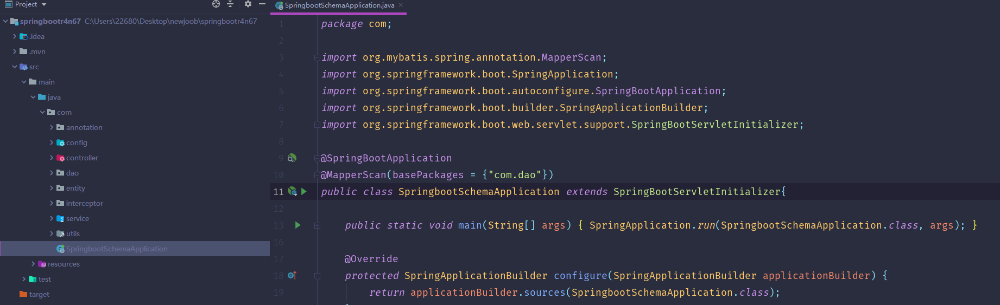

数据库表

登录

学员信息管理

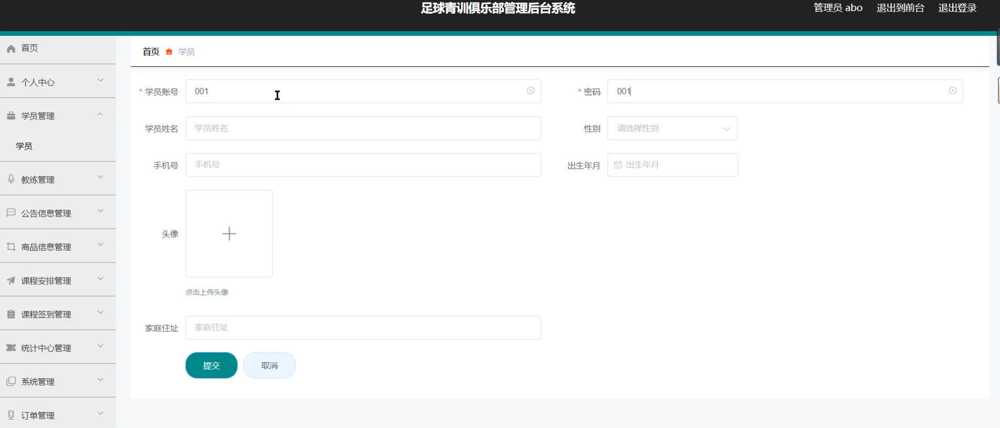

公告信息管理

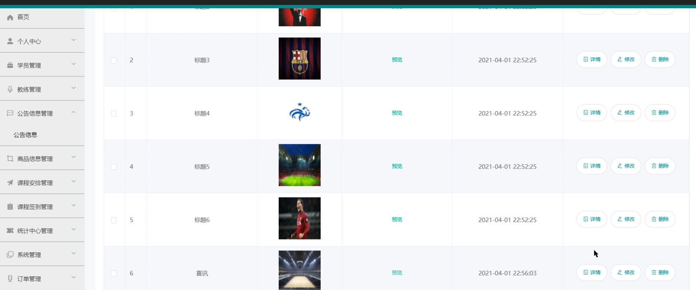

课程安排管理

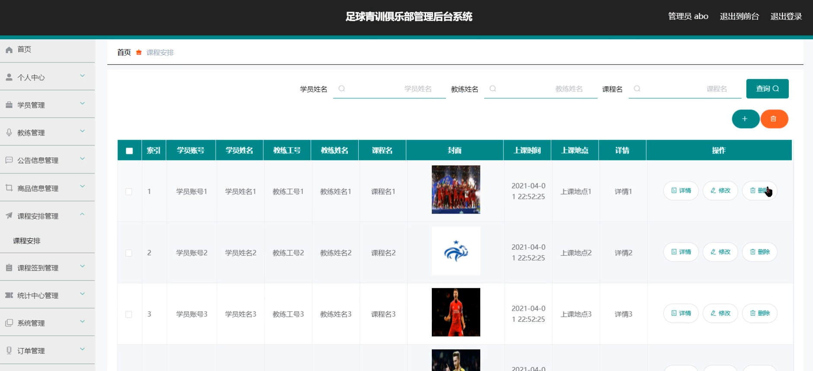

统计中心

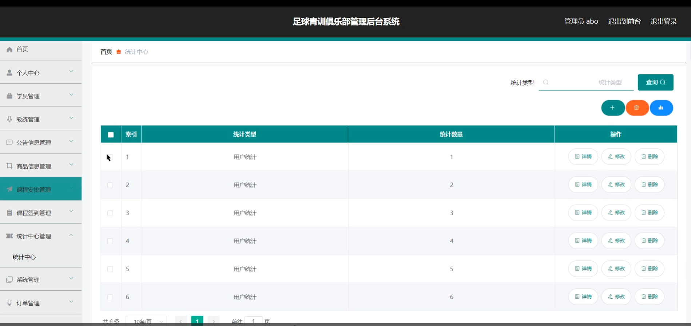

前台页面首页

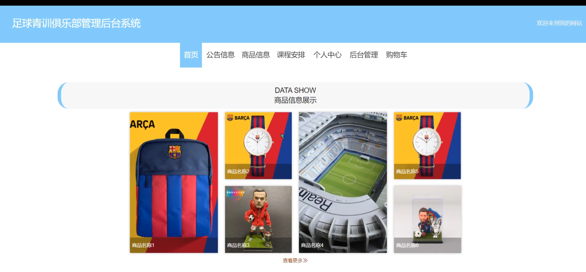

个人中心

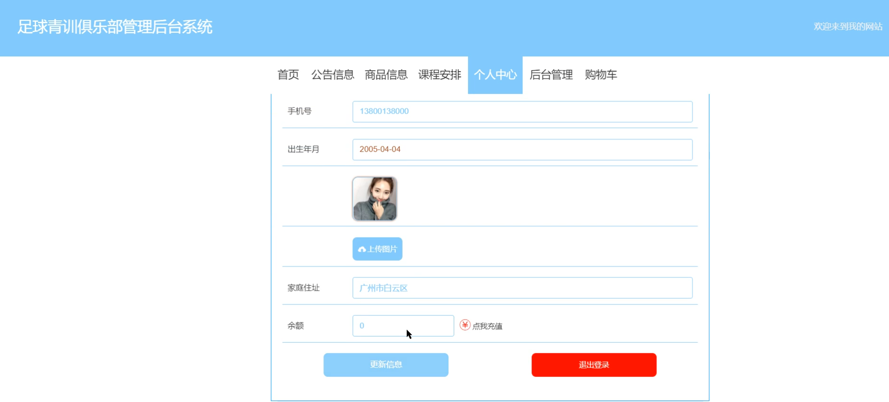

购物车

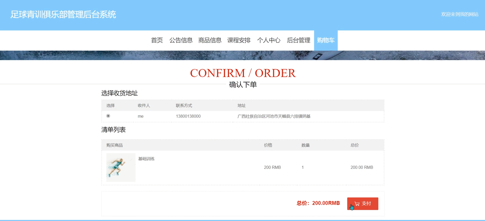

学员端后台管理

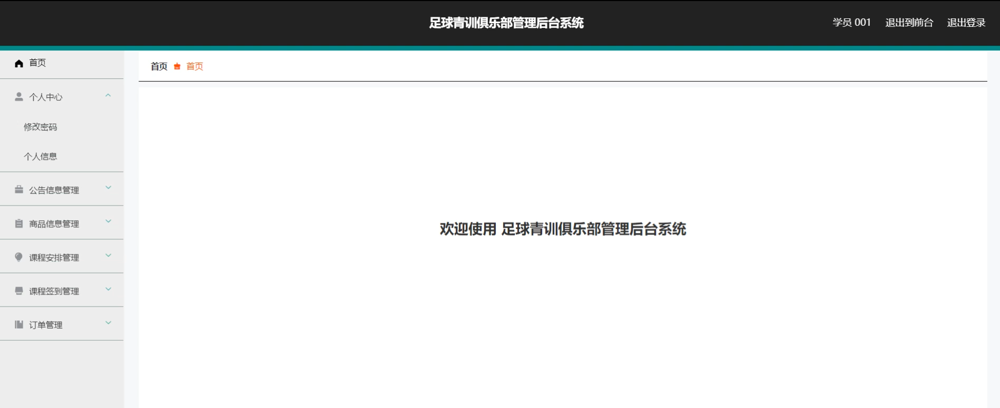

教练端后台管理

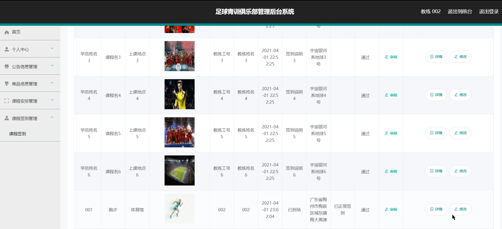

课程签到

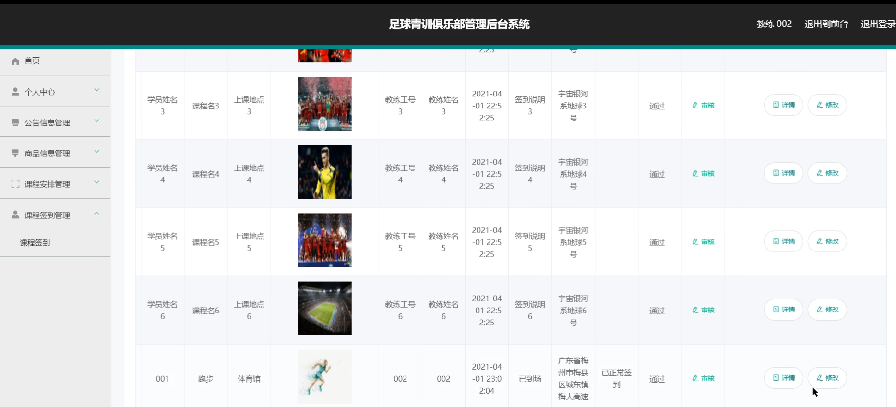

#### 总结

基于Web的足球青训俱乐部管理后台系统通过角色分工和功能模块的设计，实现了俱乐部管理的高效化和便捷化。管理者可以通过系统高效管理学员、教练和课程，确保俱乐部的正常运营；教练可以方便地管理课程和学员，提高教学质量；学生则可以方便地获取信息和管理课程，享受便捷的学习和购物体验。该系统不仅提升了俱乐部管理的效率，也为用户提供了优质的服务体验。

#### 使用说明

创建数据库，执行数据库脚本 修改jdbc数据库连接参数 下载安装maven依赖jar 启动idea中的springboot项目

后台地址：http://localhost:8080/springbootr4n67/admin/dist/index.html

管理员  abo 密码 abo

前台地址：http://localhost:8080/springbootr4n67/front/index.html
